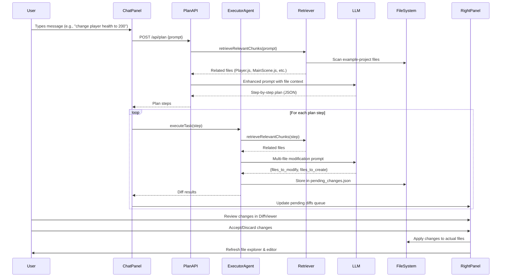
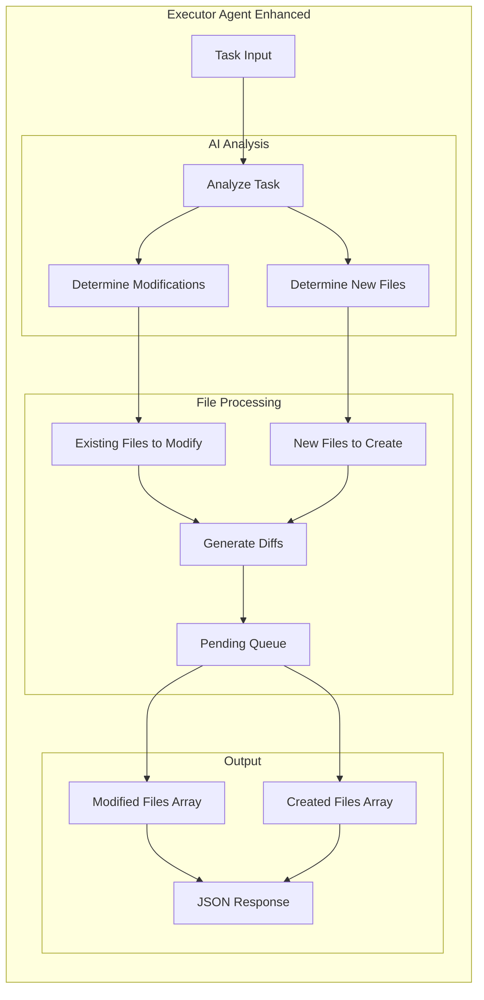
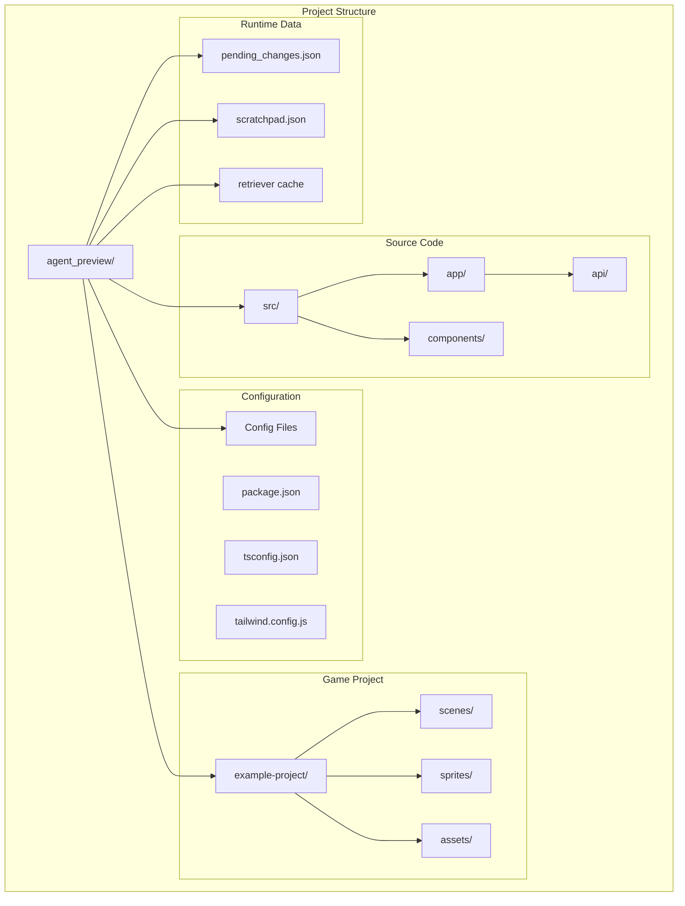
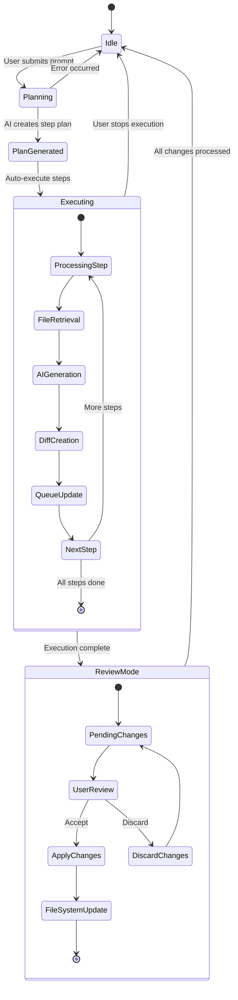

# V0/Lovable AI Coding Assistant - Architecture Flowchart

## 🏗️ High-Level System Architecture

```mermaid
graph TB
    %% User Interface Layer
    UI[User Interface Layer]
    
    %% Main Components
    subgraph "Frontend Components"
        CP[ChatPanel - Left Side]
        RP[RightPanel - Code/Files/Preview]
        FE[FileExplorer - Sidebar]
        ME[MonacoEditor - Code Editor]
        DV[DiffViewer - Change Review]
        PV[Preview - Phaser.js Game]
    end
    
    %% API Layer
    subgraph "API Routes (/api/)"
        PA[Plan API - /plan]
        EA[Execute API - /execute-task]
        AC[Apply Change - /apply-change]
        FA[Files API - /files]
        PR[Preview API - /preview]
        DP[Dynamic Path - /[...path]]
        PC[Pending Changes - /pending-changes]
    end
    
    %% Core Engine
    subgraph "AI Engine"
        RET[Retriever System]
        EXE[Executor Agent]
        LLM[LLM APIs (OpenAI + Gemini)]
    end
    
    %% File System
    subgraph "File System"
        EP[Example Project Files]
        PF[Pending Changes JSON]
        SP[Scratchpad JSON]
    end
    
    %% Data Flow
    UI --> CP
    UI --> RP
    RP --> FE
    RP --> ME
    RP --> DV
    RP --> PV
    
    CP --> PA
    CP --> EA
    DV --> AC
    FE --> FA
    PV --> PR
    PR --> DP
    
    PA --> RET
    EA --> RET
    EA --> EXE
    PA --> LLM
    EXE --> LLM
    
    RET --> EP
    AC --> EP
    EXE --> PF
    PA --> SP
    
    FA --> EP
    DP --> EP
```

## 🔄 User Interaction Flow



## 🧠 Smart File Retrieval System

```mermaid
graph TD
    subgraph "Retriever System Flow"
        UP[User Prompt: "change player health"]
        
        subgraph "File Discovery"
            FS[Scan example-project/]
            FF[Found Files: main.js, Player.js, Enemy.js, etc.]
        end
        
        subgraph "Keyword Matching"
            KE[Extract Keywords: "change", "player", "health"]
            KM[Keyword Matching Logic]
            
            subgraph "Matching Rules"
                R1[player/health/hp → Player.js, MainScene.js]
                R2[enemy/monster → Enemy.js]
                R3[bullet/projectile → Bullet.js]
                R4[scene/game → Scene files]
            end
        end
        
        subgraph "Smart Filtering"
            RF[Relevant Files: Player.js, MainScene.js, UIScene.js]
            FC[File Content + Metadata]
        end
        
        UP --> FS
        FS --> FF
        FF --> KE
        KE --> KM
        KM --> R1
        KM --> R2
        KM --> R3
        KM --> R4
        R1 --> RF
        R2 --> RF
        R3 --> RF
        R4 --> RF
        RF --> FC
    end
```

## 🔧 Multi-File Processing Architecture



## 🎮 Preview System Architecture

```mermaid
graph TB
    subgraph "Phaser.js Preview System"
        PB[Preview Button Clicked]
        
        subgraph "Preview API (/api/preview)"
            PA[Check for index.html]
            JS[Collect JS files]
            HS[Generate HTML structure]
            AS[Asset path resolution]
        end
        
        subgraph "Dynamic File Serving (/api/[...path])"
            DS[Dynamic file serving]
            IT[Image/Text detection]
            IC[Image content (binary)]
            TC[Text content (processed)]
        end
        
        subgraph "Browser Rendering"
            IF[Iframe container]
            PL[Phaser.js CDN load]
            GS[Game scripts load]
            AI[Asset images load]
            GR[Game rendering]
        end
        
        PB --> PA
        PA --> JS
        JS --> HS
        HS --> AS
        AS --> DS
        DS --> IT
        IT --> IC
        IT --> TC
        IC --> AI
        TC --> GS
        GS --> IF
        AI --> IF
        IF --> PL
        PL --> GR
    end
```

## 📁 File System Organization



## 🔄 State Management Flow



## 🎯 Key Features Summary

### 1. **Smart File Retrieval**
- Keyword-based matching system
- Context-aware file discovery
- Intelligent filtering for relevance

### 2. **Multi-File Processing**
- Can modify existing files AND create new files
- Proper directory structure creation
- Comprehensive diff generation

### 3. **Live Preview System**
- Real-time Phaser.js game preview
- Dynamic asset serving
- Error handling and recovery

### 4. **Queue-Based Change Management**
- Multiple pending changes support
- Individual review and approval
- Batch operations available

### 5. **Enhanced Logging & Debugging**
- Console logging for file retrieval
- Step-by-step execution tracking
- Error reporting and recovery

## 🚀 Technology Stack

- **Frontend**: Next.js 14, React, TypeScript, Tailwind CSS
- **Code Editor**: Monaco Editor (VS Code engine)
- **Game Engine**: Phaser.js 3.x
- **AI APIs**: OpenAI GPT-4 + Google Gemini
- **File Processing**: Node.js fs module, diff-match-patch
- **State Management**: React hooks and context
